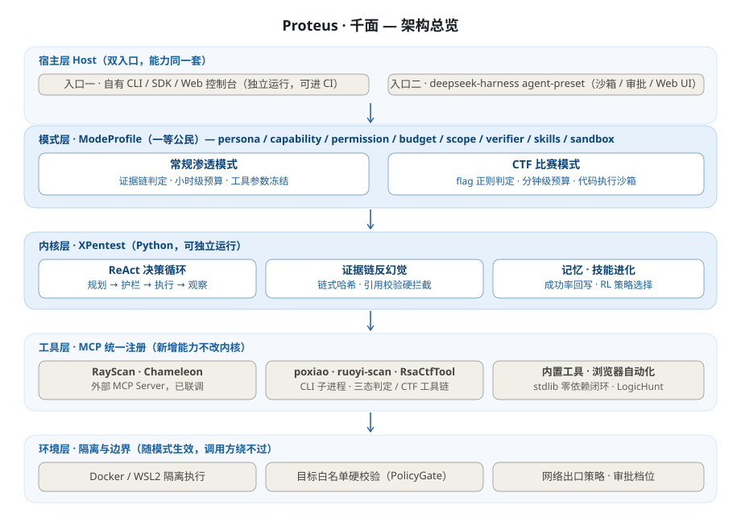
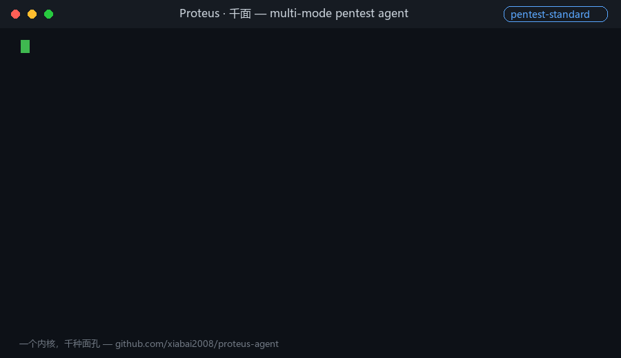

# Proteus · 千面 — 多模式渗透测试 Agent

[](https://github.com/xiabai2008/proteus-agent/actions/workflows/ci.yml)
[](LICENSE)


> **一个内核，千种面孔。**
> Proteus（普罗透斯）：希腊神话中的海上老人，可随心变换任意形态——多模式切换的完美隐喻。
> 千面：一个内核，适配千种作战场景。

## 预览

**架构总览**



**30 秒演示**（真实作战记录渲染：pentest-standard 侦察任务 + ctf-crypto 编码链解题，含权限闸门拦截与证据链收口）



---

**仓库命名**：`proteus-agent`（GitHub `xiabai2008/proteus-agent`，命名空间已核验可用，2026-09-17）

---

## 快速开始

**0）环境准备**：复制 `.env.example` 为 `.env`，填入 LLM 端点三键（`PENTEST_LLM_BASE_URL / API_KEY / MODEL`，OpenAI 兼容）与本机路径（`PENTEST_WS / PENTEST_TOOLS / PENTEST_PY312 / PENTEST_G07_ROOT`，不填则对应外部工具自动降级跳过）。安装依赖：`pip install -r requirements.txt`。

**入口一 · CLI（日常主用）**

```bash
# 起一个授权本地靶子
python examples/target.py --port 8080

# 渗透模式侦察任务（真 LLM 决策 + 证据链 + 反幻觉）
python -m penagent run --mode pentest-standard --target http://127.0.0.1:8080 \
    --objective "识别开放端口、Web 技术栈、敏感路径与信息泄漏"

# CTF 模式解题（题面由 examples/eval_ctf_solve.py 生成到 data/eval-ctf/）
python -m penagent run --mode ctf-crypto --target data/eval-ctf/encoding-chain.txt \
    --objective "解出 flag"

# 任务后复盘 → 技能沉淀（越用越准的关键一步）
python -m penagent reflect <mission_id>

# 查看经验库 / 作战记录 / 证据链校验 / 技能盲区
python -m penagent skills && python -m penagent missions
python -m penagent verify && python -m penagent gaps

# 能力评测：跑一遍看评分卡（可落盘、可跨版本对比）
python examples/benchmark.py --suite all          # CTF 33 题 + 演示靶 + 真实靶场 + 07 套件
python examples/benchmark.py --suite lab          # 真实靶场基线（DVWA / Juice Shop / sw-secure-lab）
python examples/benchmark.py --compare data/benchmark/baseline.json
```

**入口二 · Web 控制台**（模式选择 / 实时步骤流 / 证据链视图）

```bash
python web/server.py            # 默认 http://127.0.0.1:8770
```

**入口三 · 挂到 deepseek-harness**（复用沙箱 / 审批 / AgentTeams）

```bash
# preset 已在 dsh/.agent-presets/proteus，按 docs/DSH宿主接入指南.md 安装后：
dsh  # 会话内直接用自然语言下任务，工具以 mcp__proteus__* 出现
```

**入口四 · 作为 MCP Server 被任意 LLM 客户端调用**（Claude Code / Codex / OpenCode…）

```bash
python -m penagent mcp --targets 127.0.0.1
```

模式清单见 `modes/`（pentest-standard / ctf-web / ctf-crypto），知识检索（seckb 知识库）与外部工具（RayScan / Chameleon）按 `penagent/mcp_servers.json` 声明自动接入。


## 一、项目定位

支持多模式切换的渗透测试 Agent：同一套内核，通过 ModeProfile（模式档案）在**常规渗透测试模式**、**CTF 比赛模式**等场景之间机制性切换——工具白名单、参数冻结、权限档位、预算策略、成功判定器全部随模式生效。

**主推架构（方案 C 为主线 + 方案 D 为宿主层）**：

```
宿主层（双入口，能力同一套）
  入口一 · 自有 CLI / Python SDK（独立运行，可进 CI）
  入口二 · DSH agent-preset 插件（白拿沙箱 / 审批 / Web UI）
        │
模式层 · ModeProfile（一等公民，本次新建的核心）
  persona / capability / permission / budget / scope / verifier / skills / sandbox
        │
内核层 · XPentest（已 fork 入仓 `penagent/` 包 · 304 测试）
  ReAct 决策循环 · 证据链反幻觉 · 记忆与技能进化
        │
工具层 · MCP 统一注册（新增能力不改内核）
  RayScan · Chameleon · poxiao · ruoyi-scan · LogicHunt · 本地 70+ 二进制
        │
环境层 · 隔离与边界（模式可覆盖）
  Docker/WSL2 · 目标白名单硬校验 · 网络出口策略
```

**两条硬规则**：
1. 模式约束必须在**工具执行前**机制性生效（如 safe 模式下 `nuclei: null` 直接禁用），不能只写在提示词里靠模型自觉。
2. **可插拔 Verifier（成功判定器）是 CTF 与渗透模式的分水岭**：CTF 挂 `flag_regex`，渗透挂 `evidence_chain`。

---

## 二、为什么叫 Proteus · 千面

| 候选名 | 中文 | 结论 |
|---|---|---|
| **Proteus（选定）** | **千面** | 变形海神，随心换形；"千面"对齐既有命名风格（破晓/淬火/逻猎/星图/语巢），双关"多模式"与"红队伪装" |
| Janus | 双面/双阙 | 双面门神，贴合"双模式 + 双入口"，但暗示只有两种模式，格局小了 |
| Mirage | 蜃楼 | 红队幻象味浓，偏攻防对抗叙事，不强调模式机制 |
| Kaleido | 万华 | 一个筒千种图案，意象美但偏视觉，与渗透无强关联 |

避开"破晓"（已被 poxiao 与 dawnforge-pentest 同时占用，本就存在撞名）。

---

## 三、路线决策（2026-09-17 定稿）

| 路线 | 结论 | 一句话理由 |
|---|---|---|
| A 从零完全自研 | **排除** | XPentest 7210 行就是答案，成本已付过 |
| B 魔改 deepseek-harness 当内核 | **不作为主线** | TS/Cordis 与全 Python 资产的跨语言鸿沟；Windows 沙箱实际关闭；无取证反幻觉；上游是 RC 版会 breaking |
| **C 自有内核 + MCP 工具化 + 宿主双入口** | **主线** | 复用已有内核/工具/技能，边际成本最低；全栈自有代码叙事最强；不跟随上游 |
| D DSH 宿主插件化 | **C 的宿主层，并行推进** | agent-preset 挂载点干净，不改核心代码即可白拿沙箱/审批/Web UI/AgentTeams |

依据你自己定下的原则（《红队平台自建方案》）：**手脚不依赖大脑也能跑——dsh 挂了，CLI 照常能用。**

---

## 四、目录导航

```
proteus-agent/
├── AGENTS.md                                  AI 会话唯一事实来源（硬规则/环境约定/模式规范）
├── README.md                                  本文件（项目主页）
├── penagent/                                  内核包（fork 自 XPentest，独立成仓）
│   ├── agent.py / modes.py / policy_gate.py   ReAct 循环 + ModeProfile + 执行前闸门
│   ├── evidence.py / verifier.py              证据链反幻觉 + 可插拔判定器
│   ├── memory.py / reflect.py / gaps.py / ppo.py / rl.py   记忆分区与进化链路
│   ├── sandbox.py / registry.py / mcp.py / mcp_client.py   沙箱分档 + MCP 统一注册
│   ├── builtin_tools.py / external_tools.* / cft_tools.*   内置/外部/CTF 工具链
│   └── cli.py / envcfg.py                     CLI 入口 + ${VAR} 环境变量装载
├── modes/                                     模式档案（base / pentest-standard / ctf-web / ctf-crypto）
├── prompts/                                   模式人格提示词模板
├── dsh/                                       DSH agent-preset（proteus 挂载包 + 一键启动器）
├── web/                                       Web 控制台（真内核 / scripted 双驱动）
├── examples/                                  评测与演示脚本（mode_switch / ctf_solve / RL 进化 / 靶场）
├── tests/                                     pytest 全量（304 例）
├── tools/                                     文档与维护脚本（md2html / GIF 生成器 / 路径脱敏）
├── data/                                      运行时数据（作战记录 / 技能库 / 评测产物，gitignore）
└── docs/                                      调研、设计与实测记录（见下）
```

**docs/ 关键文档**：

| 文档 | 内容 |
|---|---|
| 渗透测试Agent调研报告-多模式切换.md | 主报告：竞品/资产/路线/方案（2026-09-17） |
| 个人渗透Agent产品设计.md | XPentest 设计基线（LLM 决策第一原则/进化闭环） |
| 红队平台自建方案-SRC渗透流水线.md | "手脚与大脑分层"架构原则出处 |
| 阶段一验收报告.md | 模式抽象验收（ModeProfile/Verifier/记忆分区逐条自检） |
| 端到端实战演练.md | 渗透全流程 + CTF 三题真机实测与问题清单 |
| DSH宿主接入指南.md / DSH宿主实测记录.md | 方案 D 宿主层的接入与验证 |
| Web真内核实测记录.md / RL链路实测记录.md | Web 控制台与 RL 进化的实测证据 |
| 沙箱降级评估.md | 隔离档位边界决策（拒绝而非降级，ADR） |
| 评测骨架.md | 能力度量：评分卡 / 落盘 / 跨版本对比（`examples/benchmark.py`） |
| 能力加强路线.md | 六个加强方向 + 优先级 + 反目标 |
| 修复待办清单.md | 已发现问题的编号台账（含本轮 11 项已修） |

**历史关联资产（保持原位，不搬迁）**：

| 资产 | 位置 | 角色 |
|---|---|---|
| XPentest 内核上游 | `<WS>\网安项目开发规划\10-pentest-agent\` | fork 来源（本仓库已独立演进） |
| DawnForge 技能库 + modes.yaml | `<WS>\dawnforge-pentest\`（部署副本 `<TOOLS_DIR>\`） | 模式雏形出处 |
| 工具军火库（约 70 个二进制） | `<TOOLS_DIR>\{bin,tools}` | 工具层，配置化注册 |
| deepseek-harness | `<WS>\deepseek-harness\` | 方案 D 宿主（只配不改） |
| RayScan / Chameleon（已 MCP 化） | `<WS>\RayScan\` / `Chameleon\` | 工具层首批接入 |

---

## 五、当前状态（2026-09-19）

**环境变量约定（可移植性）**：本仓库入库文件**不含任何本机绝对路径**。配置 JSON 里写 `${VAR}` 占位符，真实路径放在不入库的 `.env`（模板见 `.env.example`），由 `penagent/envcfg.py` 统一装载与展开：

| 变量 | 含义 |
|---|---|
| `PENTEST_WS` | 工作区根（poxiao / RayScan / 本仓库等所在目录） |
| `PENTEST_TOOLS` | 本地工具库根（httpx / nuclei 等二进制） |
| `PENTEST_PY312` | Python 3.12 解释器路径（DSH preset 使用） |
| `PENTEST_G07_ROOT` | 07 靶场（warfare 包）根，评测脚本依赖 |
| `PENTEST_LLM_BASE_URL` / `PENTEST_LLM_API_KEY` / `PENTEST_LLM_MODEL` | OpenAI 兼容 LLM 端点 |

未设置时对应工具自动"未注册/跳过"，不崩溃——CI（无本地工具与靶场）即按此降级运行。

---

三阶段已全部完成并通过真机验证：

| 阶段 | 状态 | 验证证据 |
|---|---|---|
| 一 · 模式抽象 | 完成 | ModeProfile + 可插拔 Verifier（evidence_chain / flag_regex）+ 记忆按模式分区；验收报告见 `docs/阶段一验收报告.md` |
| 二 · 能力补齐 | 完成 | MCP 统一注册中心 + CTF Crypto/Misc 工具链 + 沙箱分级（无容器时拒绝而非裸跑） |
| 三 · 宿主与界面 | 完成 | DSH agent-preset（24 工具挂载）+ Web 控制台三视图（真内核 / scripted 双驱动） |

**测试**：304 passed（本机 torch 2.8.0+cpu 就位；torch 保持可选依赖定位，屏蔽时 RL 链路用例按环境跳过）。

**三链路真机实测**（记录见 docs/）：DSH 宿主（preset 发现 / stdio 拉起 / mcp-client 真实调用）· Web 真内核（LLM 决策 + SSE 步骤流 + 证据链 integrity）· RL 进化（步数 6.0→3.0，-50%；闭环评测 Q 层 -39% / PPO 层 -42%）。

**安全姿态**：PolicyGate 由 ToolRegistry 持有，目标白名单 + 高危授权在 ReAct / MCP / Web 全入口机制性生效；MCP 失败语义修正（isError）；ctf-* 模式的脚本执行强制沙箱档位，无容器环境拒绝而非裸跑。预算字段已全部机制性消费：`scope.network_egress=false` 闸门+沙箱双层拒绝出网工具、`budget.model_tier` 档位模型路由（recon/strong 分档）、`budget.max_minutes` 超时换策略收口（`max_cost_usd` 因网关不回 token 用量标注预留）。

**安全评审**：F-E2E-3 已收口——`rsactf_attack` 维持宿主直跑（离线数学攻击、无网络出口；专用镜像 proteus-sandbox 虽已内置 RsaCtfTool（R-15），但默认镜像不含它且需显式配置 `PENTEST_DOCKER_IMAGE`，Docker-free 环境提权后仍不可用），人工把关由 require_confirm 档位承担；结论与依据登记于 `penagent/ctf_tools.json`，契约用例 `test_rsactf_attack_review_locks_host_direct_tier` 锁定防止静默改档。

**下一步**：Web 控制台 ask 档人工确认通道实测（F-E2E-5）· `pentest-standard` 的 `scope.network_egress: false` 与渗透工具出网需求的矛盾（R-16）· SQLi/暴力破解等 require_confirm 审批闭环的实战覆盖 · 镜像内渗透工具扩到 nuclei/ffuf 等（需先解决模板/字典依赖）· 记忆/技能进化长周期数据沉淀。

---

> **安全声明**：仅用于授权范围内的受控安全实验（自有靶机 / CTF 靶场 / 隔离容器）。目标白名单硬校验 + 高危操作审批 + 全动作证据链留痕是不可妥协的前提。严禁在未授权系统上运行。
